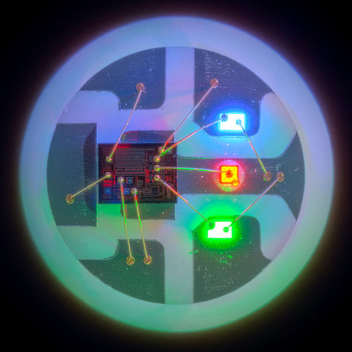

# MoodCube
3D lattice of RGB LEDs driven by ANN with environmental sensors as inputs

### Existing Things
1. Programmable cube ($390) with Mic and Acc:  http://cubetube.org/
1. http://www.instructables.com/id/8X8X8-RGB-LED-Cube/
1. NeoPixel (https://learn.adafruit.com/adafruit-neopixel-uberguide/overview) single wire, RGB

### Signal Flow
1. Something acquires a sample each from many sensors
1. These samples are passed to a Neural Network which does some nonlinear processing on the vector of input time series.
1. The outputs of the NN are passed to a an output processor, which takes the outputs and writes them to the LEDs.

### LED Drive
1. The NeoPixel or DotStar style of Arduino / Raspberry Pi compatible LEDs are a single strip of addressable RGB LEDs.
    1. there are 3rd party products also like [HKBAYI](https://www.amazon.com/240pixels-programmable-Individually-addressable-Waterproof/dp/B00K7UHPEC/ref=sr_1_2?s=musical-instruments&ie=UTF8&qid=1492325071&sr=1-2&keywords=neopixel)
1. The [FadeCandy](http://www.misc.name/fadecandy) board takes a USB input and can drive 8 strips having 64 LEDs each. That's a total of 8x64 = 512 LEDs.
    1. could do a cube with 4 sides + 1 top. 10x10 LEDs per side = 500 total.
1. The LED strips can be mounted on some clear plastic rods so as to make the shape into something like a cube.
    1. use a 3D printer to make some wild shapes to mount it on: trees, spheres, Japanese lantern, Klein bottle
    1. maybe hang them from a frame like Hanging Gardens or the living trees in Avatar
1. needs ~60 mA per LED for full power. Should use a 5V, 10A AC/DC adapter and a power bus to spread power to each strip.
------

------
* GitHub Markdown: https://guides.github.com/features/mastering-markdown/
